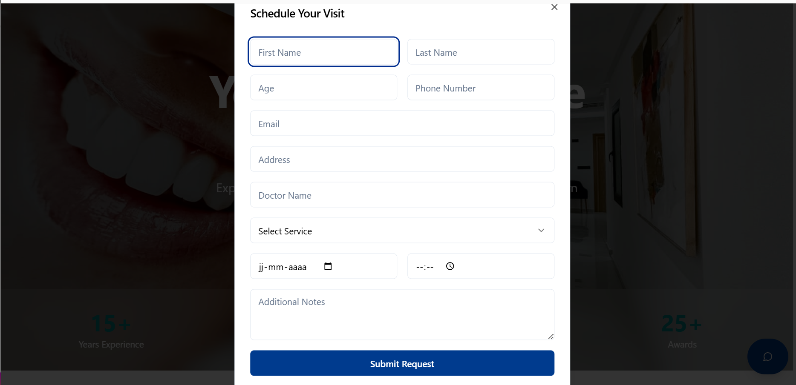
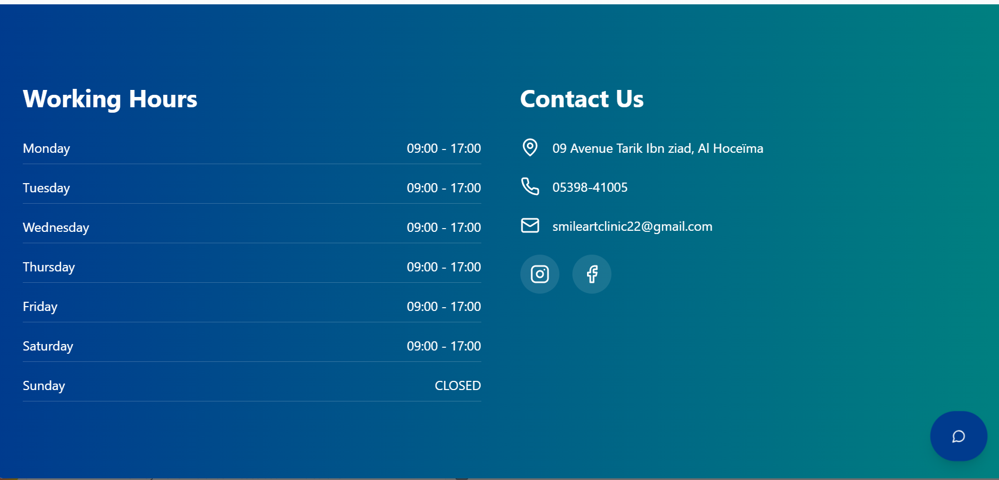
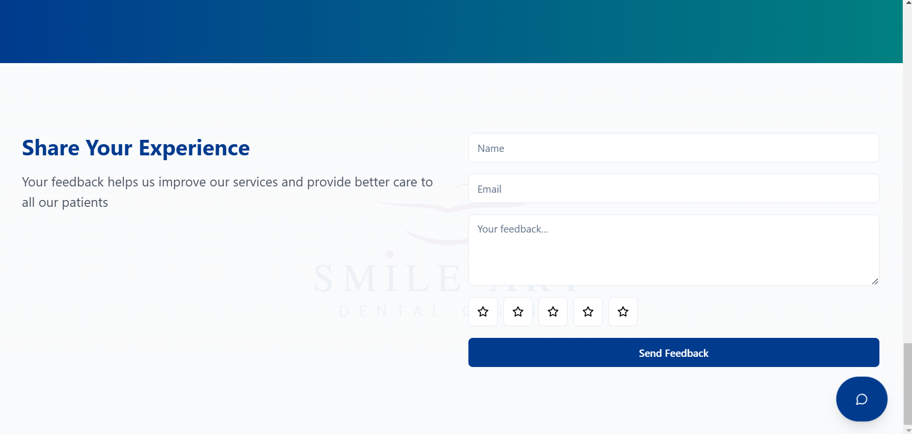

#### **Appointment System - Microservices-Based Distributed System** 

*This project was submitted as the **final module project** for the Microservices-Based Distributed Systems course.*


---

##  **Project Overview**
A clinic appointment system  designed to facilitate patient appointments, doctor selection, service bookings, reminders, notifications, and feedback collection. Patients can interact with the **RAG Assistant**, a chatbot that helps guide them in booking appointments, choosing the right doctor, understanding services, and checking prices. The backend is implemented using microservices, with each service responsible for a specific functionality in the system. 


---
## Service Details

| Service               | Description                                                                                     | Tech Stack                                                                 |
|-----------------------|-------------------------------------------------------------------------------------------------|----------------------------------------------------------------------------|
| **RAG Assistant**     | Chatbot helping patients with booking, doctor selection, and service information               | Spring AI, OpenAI GPT-4, pgvector (PostgreSQL)                            |
| **Appointment Service** | Manages appointment creation, viewing, updating, and cancellation                             | Spring Boot, JPA, MySQL                               |
| **Notification Service** | Sends email notifications about appointment updates                                           | JavaMailSender, Kafka                                                      |
| **Reminder Service**    | Sends SMS reminders for upcoming appointments                                                 | Twilio API                                                                 |
| **Discovery Service**   | Manages microservice discovery and inter-service communication                                | Eureka                                                                     |
| **Config Service**      | Provides centralized configuration management                                                | Spring Cloud Config                                                        |
| **Feedbacks Service**   | Collects and manages patient feedback                                                        | Spring Boot, JPA (Hibernate), MySQL                      |
| **API Gateway**         | Routes external requests to appropriate microservices                                        | Spring Cloud Gateway                                                       |

## 📂 **Repository Structure**
```bash
├── .idea/
├── appointment-service/
├── appointment-system-front/        # Frontend (coming soon!)
├── config-service/
├── discovery-service/
├── feedbacks-service/
├── gateway-service/
├── notification-service/
├── rag-assistant/                   # Spring AI + GPT-4 RAG
├── rag-assistant-langchain/         # Langchain4j + Astradb variant
├── reminder-service/
├── config-repo/
└── docker-compose.yml
├── img/
│   ├── bookappointment.png
│   ├── workinghours&contactinfo.png
│   ├── userinterface.png
│   ├── feedbacksection.png
│   └── chatbot.png
└── README.md
```
---

## 🛠️ **Getting Started**

### Prerequisites
- Docker
- Java 17+
- OpenAI API key (for RAG Assistant)

```bash
git clone https://github.com/yourusername/appointment-system.git
cd appointment-system
docker-compose up --build
```
### Access Points:

**API Gateway**: http://localhost:8080

**Eureka Dashboard**: http://localhost:8761

---
## ⚙️ **Core Services**

| Service                | Key Technologies                 | Responsibility                          |
|------------------------|----------------------------------|-----------------------------------------|
| **RAG Assistant**      | GPT-4, pgvector, Spring AI      | AI-powered patient guidance             |
| **Appointment**        | Spring Boot, JPA                | Appointment lifecycle management        |
| **Notification**       | Kafka, JavaMailSender           | Email notifications                     |
| **Reminder**           | Twilio API                      | SMS reminders                           |
| **Config**             | Spring Cloud Config             | Centralized configuration               |
| **Gateway**            | Spring Cloud Gateway            | API routing & load balancing            |


## 🖥️ **User Interface Preview**

<div align="center">
  <div style="display: flex; flex-wrap: wrap; gap: 20px; justify-content: center;">
    <div style="flex: 1; min-width: 300px;">
      
      <p align="center"><em> User Interface</em></p>
    </div>
  <div style="display: flex; flex-wrap: wrap; gap: 20px; justify-content: center;">
    <div style="flex: 1; min-width: 300px;">
      
      <p align="center"><em>Appointment Booking Interface</em></p>
    </div>
  <div style="display: flex; flex-wrap: wrap; gap: 20px; justify-content: center;">
    <div style="flex: 1; min-width: 300px;">
      
      <p align="center"><em>AI- Assistant</em></p>
    </div>
     <div style="display: flex; flex-wrap: wrap; gap: 20px; justify-content: center;">
    <div style="flex: 1; min-width: 300px;">
      
      <p align="center"><em>Working hours & Contact info </em></p>
    </div>
     <div style="display: flex; flex-wrap: wrap; gap: 20px; justify-content: center;">
    <div style="flex: 1; min-width: 300px;">
      
      <p align="center"><em>Feedbacks Section</em></p>
    </div>
    
    
</div>


**Note:** The frontend code  for the appointment system is coming soon and is being actively developed to include additional features and UI enhancements.

---
### Credits
Special thanks to my supervisor

[**Dr. EL OUAHIDI Bouabid**](#https://www.researchgate.net/profile/Bouabid-Ouahidi)

*Department of Computer Science*

[Mohammed V university of Rabat](#https://www.um5.ac.ma/) 


## 🔗 Useful Links

### Alternative Implementations
Find an alternative implementation of the RAG Assistant using Langchain4j + Open AI + Astradb here 
**[RAG Assistant (Langchain4j + Astradb Version)](https://github.com/aelmah/RAG-langchain4j-astradb)**  
 


