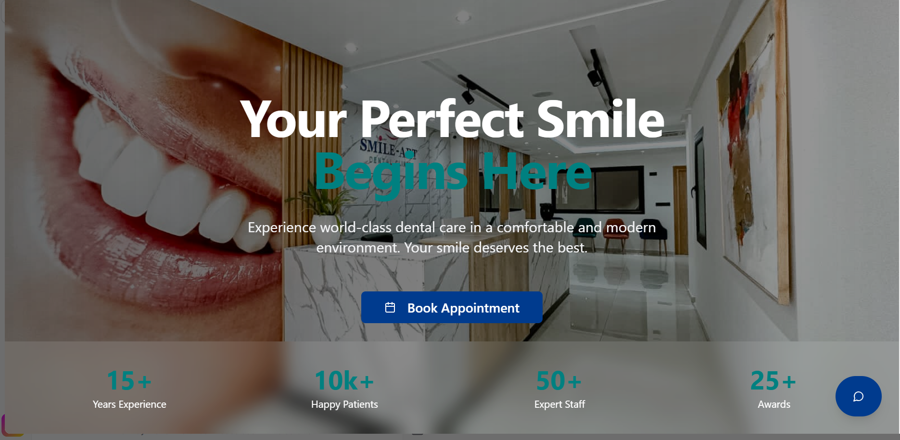
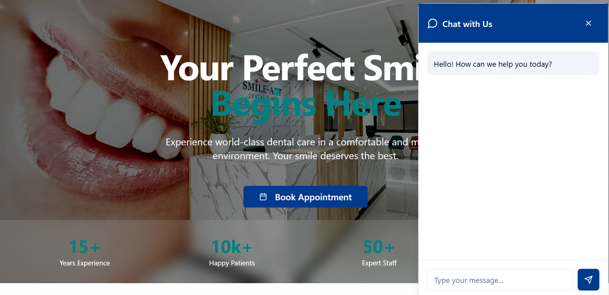

#### **Appointment System - Microservices-Based Distributed System** 

*This project was submitted as the **final module project** for the Microservices-Based Distributed Systems course. Code will be available soon after final improvements!*


---

##  **Project Overview**
A clinic appointment system featuring:
- Patient appointment booking 
- Doctor/service selection 
- SMS/email reminders & notifications
- Patient feedback collection
- **RAG Assistant** chatbot (GPT-4 powered) for guided assistance


###  Key Features
**Smart RAG Assistant:** Context-aware chatbot using Retrieval-Augmented Generation

**Auto-Scaling:** Docker-based microservice orchestration

**Unified Config:** Centralized configuration management

**Async Communication:** Kafka for notifications/reminders

**Twilio Integration:** SMS reminders via Twilio API

---

## 📂 **Repository Structure**
```bash
├── .idea/
├── appointment-service/
├── appointment-system-front/        # Frontend (coming soon!)
├── config-service/
├── discovery-service/
├── feedbacks-service/
├── gateway-service/
├── notification-service/
├── rag-assistant/                   # Spring AI + GPT-4 RAG
├── rag-assistant-langchain/         # Langchain4j + Astradb variant
├── reminder-service/
├── config-repo/
└── docker-compose.yml
├── img/
│   ├── bookappointment.png
│   ├── workinghours&contactinfo.png
│   ├── userinterface.png
│   ├── feedbacksection.png
│   └── chatbot.png
└── README.md
```
---

## 🛠️ **Getting Started**

### Prerequisites
- Docker
- Java 17+
- OpenAI API key (for RAG Assistant)

```bash
git clone https://github.com/yourusername/appointment-system.git
cd appointment-system
docker-compose up --build
```
### Access Points:

**API Gateway**: http://localhost:8080

**Eureka Dashboard**: http://localhost:8761

---
## ⚙️ **Core Services**

| Service                | Key Technologies                 | Responsibility                          |
|------------------------|----------------------------------|-----------------------------------------|
| **RAG Assistant**      | GPT-4, pgvector, Spring AI      | AI-powered patient guidance             |
| **Appointment**        | Spring Boot, JPA                | Appointment lifecycle management        |
| **Notification**       | Kafka, JavaMailSender           | Email notifications                     |
| **Reminder**           | Twilio API                      | SMS reminders                           |
| **Config**             | Spring Cloud Config             | Centralized configuration               |
| **Gateway**            | Spring Cloud Gateway            | API routing & load balancing            |


---
## 🙏 Credits
Special thanks to my professor 

[**Dr. EL OUAHIDI Bouabid**](#https://www.researchgate.net/profile/Bouabid-Ouahidi)

*Department of Computer Science*

[Mohammed V university of Rabat](#https://www.um5.ac.ma/) 

Provided expert guidance on:

- Microservices architecture design

- RAG implementation strategies

- System integration best practices 


## 🖥️ **User Interface Preview**

<div align="center">
  <div style="display: flex; flex-wrap: wrap; gap: 20px; justify-content: center;">
    <div style="flex: 1; min-width: 300px;">
      
      <p align="center"><em> User Interface</em></p>
    </div>
  <div style="display: flex; flex-wrap: wrap; gap: 20px; justify-content: center;">
    <div style="flex: 1; min-width: 300px;">
      
      <p align="center"><em>Appointment Booking Interface</em></p>
    </div>
  <div style="display: flex; flex-wrap: wrap; gap: 20px; justify-content: center;">
    <div style="flex: 1; min-width: 300px;">
      
      <p align="center"><em>AI- Assistant</em></p>
    </div>
     <div style="display: flex; flex-wrap: wrap; gap: 20px; justify-content: center;">
    <div style="flex: 1; min-width: 300px;">
      
      <p align="center"><em>Working hours & Contact info </em></p>
    </div>
     <div style="display: flex; flex-wrap: wrap; gap: 20px; justify-content: center;">
    <div style="flex: 1; min-width: 300px;">
      
      <p align="center"><em>Feedbacks Section</em></p>
    </div>
    
    
</div>


**Note:** the frontend code will be available soon after final improvements!
